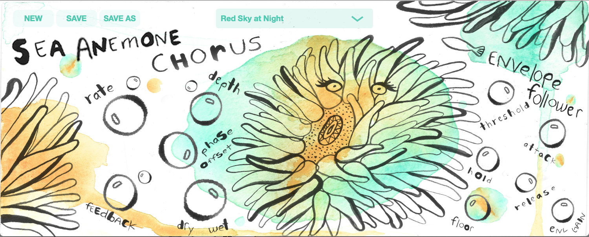

# OceanPlugIns-AnemoneChorus
## A Side-Chaining, Envelope-Following Chorus VST3 plug-in built using the JUCE Framework, Version 1.3

###   

This is the first of several plug-ins in my Ocean Plug-ins Suite.  The actual Chorus effect/DSP is pretty straight-forward, except that there is an internal envelope follower that modulates the Rate, Depth, and Feeback using the incoming audio's amplitude.  Now, in V1.3, you can also take the envelope from another track's output signal to sidechain all of the parameters.

## Design
The GUI is an excercise in music plug-in/application design.  I have produced music for several years now, and most plug-ins I am familiar with look like either:
- an existing vintage/classic analog gear
- a component in a spaceship's center console

I chose to design the GUI with water colors and sea creatures to encourage users to approach using this Chorus with a sense of discovery and perhaps a new creative approach, sort of like a child with crayons and a blank piece of paper... 

My Ocean Plug-Ins Suite will pair one audio effect with a corresponding animal.  For Chorus, I chose the Sea Anemone because it ebbs and flows with tide, and gives you a little electric sting if you accidently touch it.

## Art Work
The actual water color painting and lettering was done by my good friend, you can find her art at @peacespells on IG.  I handled the layout in Photoshop, and generated the knobs assets with a script from one of my [other repos](https://github.com/walkerdavis/producerpy) which contains music production and programming scripts.

## Code
This plug-in was built using C++, the JUCE Framework (5.4.4), and after completing Output's plug-in [development course](https://www.kadenze.com/programs/output-teaches-creating-audio-plugins-with-c-and-juce) on the Kadenze platform.  I highly recommend it if you are interested in building plug-ins.

## Demos
### Version 1.3
Here is a [quick demo on Youtube](https://www.youtube.com/watch?v=LeRMASbzmJU) of the sidechain capabilities, no phat beat at the end though.

### Version 1.2
Here is a quick [demo on Youtube with a beat for Gucci Mane ](https://www.youtube.com/watch?v=LJsQY65ch7w). 

### Version 1.1
 Here is the [first version's demo](https://www.youtube.com/watch?v=-dZqQYZgTmo), using the guitar work my good friend Jesse Green of [BeethovenBoyProductions](https://www.youtube.com/beethovenboyproductions).

## How to Use
### Big Bubble Knobs - Main Param Values
In this plug-in, I used bubbles instead of traditional rotary knobs, simply drag each knob to change their corresponding value.  Drag all the way left/down to reach the minimum of each bubble's range, drag all the way up.right to reach it's maximum.

### Small Bubble Knobs - Envelope Follower Amounts
The small bubbles above the Rate, Depth, and Feedback correlate to each of those parameters Envelope Follower Modulation Amounts.  ie. To increase the Rate's Modulation Amount when the incoming audio is loud, rotate the small bubble to the right; to decrease the Rate's Modulation Amount, rotate left.

### Sidechain
By defualt, the sidechain capability is off.  Ableton, Logic, and Maschine all have their own 'Sidechain' wrapper/combobox/dropdown menu's which allow you to select which other track you would like to sidechain from, pretty cool.  Once you select a track in any of these DAW's, the envelope follower will use that audio signal, rather than it's own.  To deactivate the sidechain, deselect the track from the dropdown menu.

## Download/Install
### [Plug-In - Mac V1.3](https://drive.google.com/drive/folders/1r7dEzZ_A_SRDSarmNiLPe2gZOQsYnl8M?usp=sharing)
Version 1.3 contains the sidechain functionality.  Thus far, I have tested it in Ableton, Logic, and Maschine.  Logic may crash if you use more than once instance, but Ableton and Maschine don't seem to mind.  The standard package installer can be found [at this link](https://drive.google.com/drive/folders/1r7dEzZ_A_SRDSarmNiLPe2gZOQsYnl8M?usp=sharing).  You will need to run the included separate preset installer to get the presets from the demo.  (Presets are not backward compatible, hence they will be in a separate folder from the V1.2 Presets.)

### [Plug-In - Mac V1.2](https://drive.google.com/file/d/1Hr0fGx76i_AV3_Gip6V4qVAmj8AZ7G4o/view?usp=sharing)
Version 1.2 does not contain sidechain functionality, but the interanl envelope still exists.  This build is likely more stable.  You can download the installer from [from this link](https://drive.google.com/file/d/1Hr0fGx76i_AV3_Gip6V4qVAmj8AZ7G4o/view?usp=sharing).  You will need to run the installer for both the plug-in and presets.

### Plug-In - Windows
Currently, there is no installer package, so you will need to build this project yourself.  Working on the Windows version currently, apologies for the wait.

## Optional Donation
Feel free to use this plug-in for free, but if you feel so inclined, you can throw me some bones via [Paypal](https://paypal.me/2076la?locale.x=en_US).

I really enjoyed putting this together.  Additional and improved functionality on the way!  Feel free to reach out with any feedback(no pun intended) and/or thoughts!

-Walker
