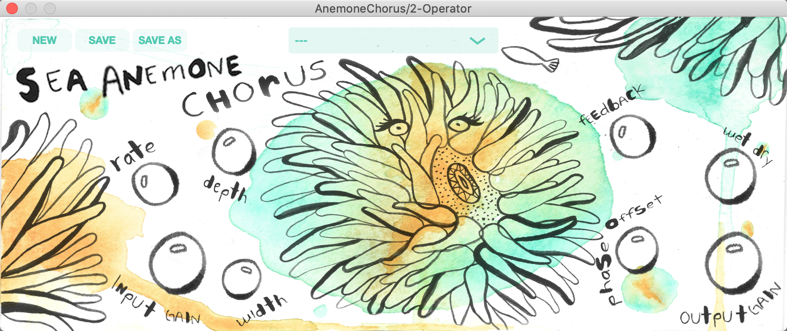

# OceanPlugIns-AnemoneChorus
## A Chorus VST plug-in built using the JUCE Framework

###   

This is the first of several plug-ins in a my Ocean Plug-ins Suite.  The actual Chorus effect/DSP is pretty straight-forward, not reinventing the wheel here.  

## Design
The GUI is an excercise in music plug-in/application design.  I have produced music for several years now, and most plug-ins I am familiar with look like either:
- an existing vintage/classic analog gear
- a component in a spaceship's center console

I chose to design the GUI with water colors and sea creatures to encourage users to approach using this Chorus with a sense of discovery and perhaps a new creative approach, sort of like a child with crayons and a blank piece of paper... 

My Ocean Plug-Ins Suite will pair one audio effect with a corresponding animal.  For Chorus, I chose the Sea Anemone because it ebbs and flows with tide, and gives you a little electric sting if you accidently touch it.

## Art Work
The actual water color painting and lettering was done by my good friend, you can find her art at @peacespells on IG.  I handled the layout in Photoshop, and generated the knobs assets with a script from one of my [other repos](https://github.com/walkerdavis/producerpy) which contains music production and programming scripts.

## Code
This plug-in was built using C++, the JUCE Framework (5.4.3), and after completing Output's plug-in [development course](https://www.kadenze.com/programs/output-teaches-creating-audio-plugins-with-c-and-juce) on the Kadenze platform.  I highly recommend it if you are interested in building plug-ins.

## Demo
You can view the youtube demo [here](https://www.youtube.com/watch?v=-dZqQYZgTmo).  My good friend Jesse Green of [BeethovenBoyProductions](https://www.youtube.com/beethovenboyproductions) lent me some really wavy guitar passages to bring the Anemone Chorus to life.

## Using the Plug-In
If you would like to use this plug-in without building it yourself, you can simply drag the AnemoneChorus.vst3 to its corresponding directory on your computer.  

I really enjoyed putting this together.  Additional and improved functionality on the way!  Feel free to reach out with any feedback(no pun intended) and/or thoughts!

-Walker