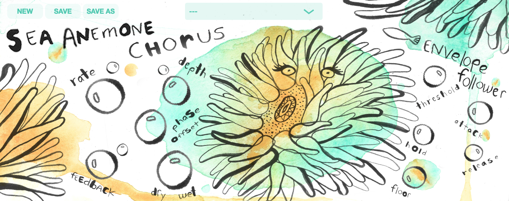

# OceanPlugIns-AnemoneChorus
## A Evelope-Following Chorus VST3 plug-in built using the JUCE Framework, Version 1.2

###   

This is the first of several plug-ins in a my Ocean Plug-ins Suite.  The actual Chorus effect/DSP is pretty straight-forward, except that there is an internal envelope follower that modulates the Rate, Depth, and Feeback using the incoming audio's amplitude.


## Design
The GUI is an excercise in music plug-in/application design.  I have produced music for several years now, and most plug-ins I am familiar with look like either:
- an existing vintage/classic analog gear
- a component in a spaceship's center console

I chose to design the GUI with water colors and sea creatures to encourage users to approach using this Chorus with a sense of discovery and perhaps a new creative approach, sort of like a child with crayons and a blank piece of paper... 

My Ocean Plug-Ins Suite will pair one audio effect with a corresponding animal.  For Chorus, I chose the Sea Anemone because it ebbs and flows with tide, and gives you a little electric sting if you accidently touch it.


## Art Work
The actual water color painting and lettering was done by my good friend, you can find her art at @peacespells on IG.  I handled the layout in Photoshop, and generated the knobs assets with a script from one of my [other repos](https://github.com/walkerdavis/producerpy) which contains music production and programming scripts.

## Code
This plug-in was built using C++, the JUCE Framework (5.4.3), and after completing Output's plug-in [development course](https://www.kadenze.com/programs/output-teaches-creating-audio-plugins-with-c-and-juce) on the Kadenze platform.  I highly recommend it if you are interested in building plug-ins.

## Demo
Here is a quick [Youtube demo and beat for Gucci Mane ](https://www.youtube.com/watch?v=LJsQY65ch7w).  The previous version's demo, using the guitar work my good friend Jesse Green of [BeethovenBoyProductions](https://www.youtube.com/beethovenboyproductions) is [here](https://www.youtube.com/watch?v=-dZqQYZgTmo).

## How to Use
### Big Bubble Knobs
In this plug-in, I used bubbles instead of traditional rotary knobs, simply drag each knob to change their corresponding value.  Drag all the way left/down to reach the minimum of each bubble's range, drag all the way up.right to reach it's maximum.

### Small Bubble Knobs
The small bubbles above the Rate, Depth, and Feedback correlate to each of those parameters Envelope Follower Modulation Amounts.  ie. To increase the Rate's Modulation Amount when the incoming audio is loud, rotate the small bubble to the right; to decrease the Rate's Modulation Amount, rotate left.


## Download/Install
### Plug-In
If you would like to use this plug-in without building it yourself, you can simply drag the AnemoneChorus.vst3 to its corresponding directory on your computer.  On Mac, that is: 

```
Macintosh HD > Library > Audio > Plug-Ins > VST3 >
```

### Presets in the video
If you like the presets from the demo, I have included them in this repo too.  Once you have opened the Chorus in your DAW, it will make a folder in you Documents directory.  Drag each of the presets into this folder, delete the instance of the plug-in, create a new instance, boom.

```
Macintosh HD > Users > $YOUR_USERNAME$ > Documents > AnemoneChorus >
```


## Optional Donation
Feel free to use this plug-in for free, but if you feel so inclined, you can throw me some bones via [Paypal](https://paypal.me/2076la?locale.x=en_US).

I really enjoyed putting this together.  Additional and improved functionality on the way!  Feel free to reach out with any feedback(no pun intended) and/or thoughts!

-Walker